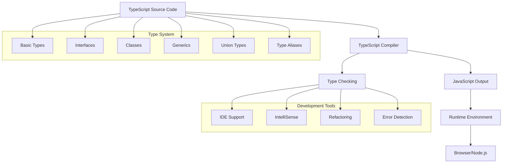

# TypeScript Architecture

```mermaid
graph TB
    A[TypeScript Source Code] --> B[TypeScript Compiler]
    B --> C[JavaScript Output]
    B --> D[Type Checking]

    subgraph "Type System"
        E[Basic Types]
        F[Interfaces]
        G[Classes]
        H[Generics]
        I[Union Types]
        J[Type Aliases]
    end

    subgraph "Development Tools"
        K[IDE Support]
        L[IntelliSense]
        M[Refactoring]
        N[Error Detection]
    end

    A --> E
    A --> F
    A --> G
    A --> H
    A --> I
    A --> J

    D --> K
    D --> L
    D --> M
    D --> N

    C --> O[Runtime Environment]
    O --> P[Browser/Node.js]
```

This diagram shows how TypeScript's type system works with the compiler to provide enhanced development experience while producing standard JavaScript output.