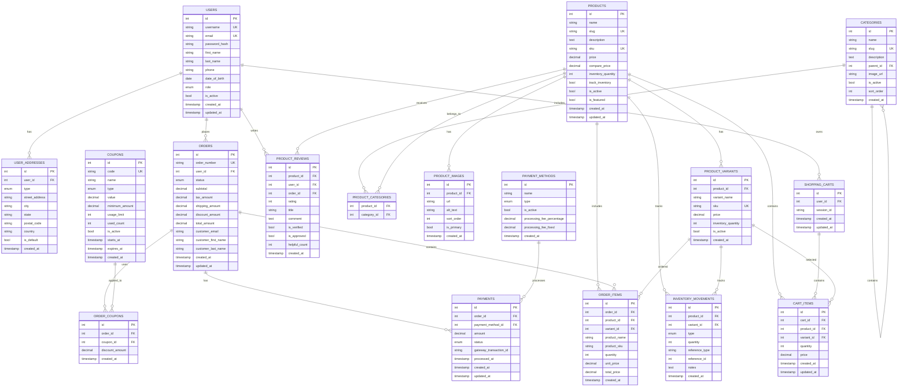

# E-commerce Database Architecture

```mermaid
erDiagram
    USERS ||--o{ USER_ADDRESSES : has
    USERS ||--o{ SHOPPING_CARTS : owns
    USERS ||--o{ ORDERS : places
    USERS ||--o{ PRODUCT_REVIEWS : writes

    CATEGORIES ||--o{ CATEGORIES : contains
    CATEGORIES ||--o{ PRODUCT_CATEGORIES : includes

    PRODUCTS ||--o{ PRODUCT_CATEGORIES : belongs_to
    PRODUCTS ||--o{ PRODUCT_IMAGES : has
    PRODUCTS ||--o{ PRODUCT_VARIANTS : has
    PRODUCTS ||--o{ CART_ITEMS : contains
    PRODUCTS ||--o{ ORDER_ITEMS : includes
    PRODUCTS ||--o{ INVENTORY_MOVEMENTS : tracks
    PRODUCTS ||--o{ PRODUCT_REVIEWS : receives

    SHOPPING_CARTS ||--o{ CART_ITEMS : contains

    ORDERS ||--o{ ORDER_ITEMS : contains
    ORDERS ||--o{ PAYMENTS : has
    ORDERS ||--o{ ORDER_COUPONS : uses

    PAYMENT_METHODS ||--o{ PAYMENTS : processes

    COUPONS ||--o{ ORDER_COUPONS : applied_to

    PRODUCT_VARIANTS ||--o{ CART_ITEMS : selected
    PRODUCT_VARIANTS ||--o{ ORDER_ITEMS : ordered
    PRODUCT_VARIANTS ||--o{ INVENTORY_MOVEMENTS : tracks

    USERS {
        int id PK
        string username UK
        string email UK
        string password_hash
        string first_name
        string last_name
        string phone
        date date_of_birth
        enum role
        bool is_active
        timestamp created_at
        timestamp updated_at
    }

    USER_ADDRESSES {
        int id PK
        int user_id FK
        enum type
        string street_address
        string city
        string state
        string postal_code
        string country
        bool is_default
        timestamp created_at
    }

    CATEGORIES {
        int id PK
        string name
        string slug UK
        text description
        int parent_id FK
        string image_url
        bool is_active
        int sort_order
        timestamp created_at
    }

    PRODUCTS {
        int id PK
        string name
        string slug UK
        text description
        string sku UK
        decimal price
        decimal compare_price
        int inventory_quantity
        bool track_inventory
        bool is_active
        bool is_featured
        timestamp created_at
        timestamp updated_at
    }

    PRODUCT_CATEGORIES {
        int product_id FK
        int category_id FK
    }

    PRODUCT_IMAGES {
        int id PK
        int product_id FK
        string url
        string alt_text
        int sort_order
        bool is_primary
        timestamp created_at
    }

    PRODUCT_VARIANTS {
        int id PK
        int product_id FK
        string variant_name
        string sku UK
        decimal price
        int inventory_quantity
        bool is_active
        timestamp created_at
    }

    SHOPPING_CARTS {
        int id PK
        int user_id FK
        string session_id
        timestamp created_at
        timestamp updated_at
    }

    CART_ITEMS {
        int id PK
        int cart_id FK
        int product_id FK
        int variant_id FK
        int quantity
        decimal price
        timestamp created_at
        timestamp updated_at
    }

    ORDERS {
        int id PK
        string order_number UK
        int user_id FK
        enum status
        decimal subtotal
        decimal tax_amount
        decimal shipping_amount
        decimal discount_amount
        decimal total_amount
        string customer_email
        string customer_first_name
        string customer_last_name
        timestamp created_at
        timestamp updated_at
    }

    ORDER_ITEMS {
        int id PK
        int order_id FK
        int product_id FK
        int variant_id FK
        string product_name
        string product_sku
        int quantity
        decimal unit_price
        decimal total_price
        timestamp created_at
    }

    PAYMENT_METHODS {
        int id PK
        string name
        enum type
        bool is_active
        decimal processing_fee_percentage
        decimal processing_fee_fixed
        timestamp created_at
    }

    PAYMENTS {
        int id PK
        int order_id FK
        int payment_method_id FK
        decimal amount
        enum status
        string gateway_transaction_id
        timestamp processed_at
        timestamp created_at
        timestamp updated_at
    }

    COUPONS {
        int id PK
        string code UK
        string name
        enum type
        decimal value
        decimal minimum_amount
        int usage_limit
        int used_count
        bool is_active
        timestamp starts_at
        timestamp expires_at
        timestamp created_at
    }

    ORDER_COUPONS {
        int id PK
        int order_id FK
        int coupon_id FK
        decimal discount_amount
        timestamp created_at
    }

    INVENTORY_MOVEMENTS {
        int id PK
        int product_id FK
        int variant_id FK
        enum type
        int quantity
        string reference_type
        int reference_id
        text notes
        timestamp created_at
    }

    PRODUCT_REVIEWS {
        int id PK
        int product_id FK
        int user_id FK
        int order_id FK
        int rating
        string title
        text comment
        bool is_verified
        bool is_approved
        int helpful_count
        timestamp created_at
    }
```

This entity relationship diagram shows the complete database structure with all tables, their relationships, and key attributes for the e-commerce application.