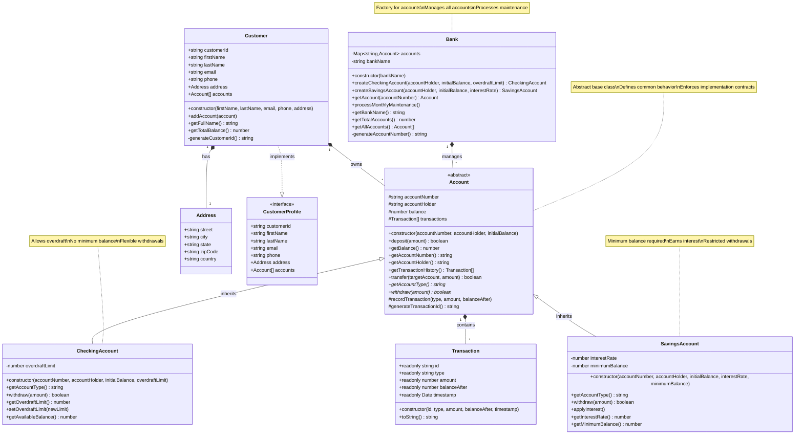

# Banking System Architecture

## Architecture Overview

This banking system architecture demonstrates key Object-Oriented Programming principles:

### Inheritance Hierarchy
- **Account (Abstract)**: Base class defining common interface
- **CheckingAccount**: Concrete implementation with overdraft capability
- **SavingsAccount**: Concrete implementation with interest and minimum balance

### Composition Relationships
- **Bank** contains multiple **Account** instances
- **Customer** has **Account** references and an **Address**
- **Account** contains **Transaction** history

### Interface Implementation
- **Customer** implements **CustomerProfile** interface
- Provides contract for customer data structure

### Key Design Patterns

#### Factory Pattern
- Bank class creates account instances
- Ensures proper initialization and registration

#### Template Method Pattern
- Account class defines transaction recording template
- Subclasses implement specific withdrawal logic

#### Encapsulation
- Private fields protected from external access
- Public methods provide controlled interface
- Protected methods allow subclass access

This architecture supports extensibility, maintainability, and demonstrates professional OOP design practices.