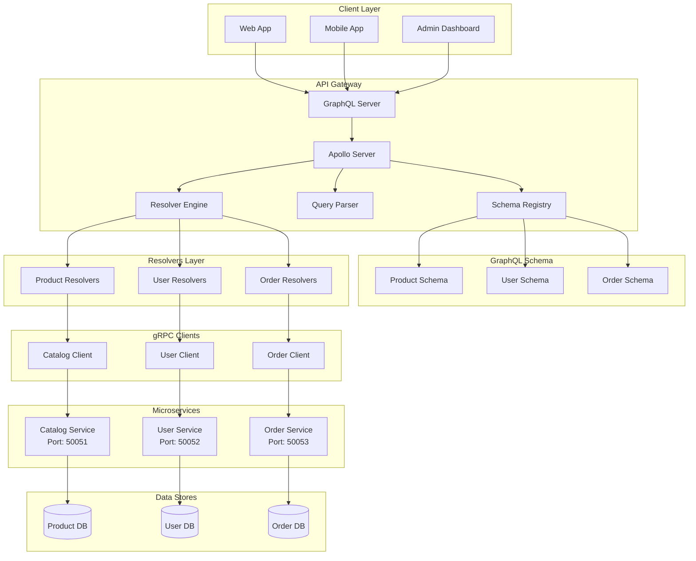
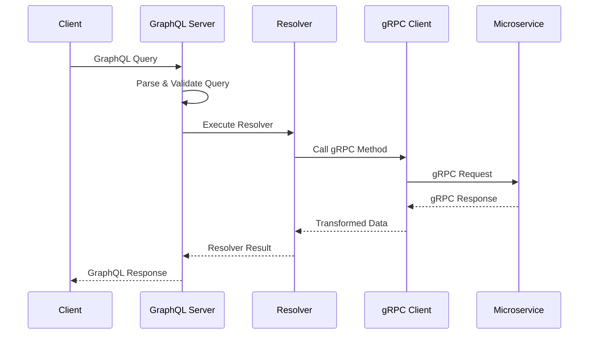

# GraphQL Microservice Architecture

## System Components

### Client Layer
- **Web App**: React/Vue.js application using GraphQL
- **Mobile App**: React Native/Flutter with GraphQL client
- **Admin Dashboard**: Management interface for system administration

### API Gateway (GraphQL Server)
- **Apollo Server**: Production-ready GraphQL server
- **Schema Registry**: Centralized schema management
- **Query Parser**: Analyzes and validates incoming queries
- **Resolver Engine**: Executes resolvers and composes responses

### Schema Definition
- **Product Schema**: Product catalog types and operations
- **User Schema**: User management and authentication types
- **Order Schema**: Order processing and tracking types

### Resolver Layer
- **Product Resolvers**: Handle product-related GraphQL operations
- **User Resolvers**: Manage user data and authentication
- **Order Resolvers**: Process order operations and status updates

### gRPC Communication Layer
- **Catalog Client**: Interface to product catalog service
- **User Client**: Interface to user management service
- **Order Client**: Interface to order processing service

### Microservices
- **Catalog Service**: Product catalog management (Port 50051)
- **User Service**: User authentication and profiles (Port 50052)
- **Order Service**: Order processing and fulfillment (Port 50053)

### Data Persistence
- **Product DB**: Product information and inventory
- **User DB**: User profiles and authentication data
- **Order DB**: Order history and transaction records

## Communication Flow

### GraphQL Query Flow

### Service-to-Service Communication
1. **GraphQL Layer**: Receives client requests
2. **Resolver Execution**: Processes query fields
3. **gRPC Calls**: Communicates with microservices
4. **Data Transformation**: Converts gRPC responses to GraphQL format
5. **Response Assembly**: Combines data from multiple services

## Key Architecture Benefits

### For Clients
- **Single Endpoint**: One URL for all data needs
- **Flexible Queries**: Request exactly what's needed
- **Type Safety**: Schema-based validation
- **Real-time Updates**: Subscription support

### For Services
- **Service Independence**: Each service owns its data
- **Efficient Communication**: gRPC for internal calls
- **Scalability**: Independent service scaling
- **Technology Diversity**: Services can use different tech stacks

### For Development
- **Schema-Driven Development**: Clear API contracts
- **Autocomplete Support**: Enhanced developer experience
- **Introspection**: Self-documenting API
- **Testing**: Easy to mock and test individual resolvers

This architecture provides a robust, scalable foundation for e-commerce applications with clear separation of concerns and efficient data access patterns.