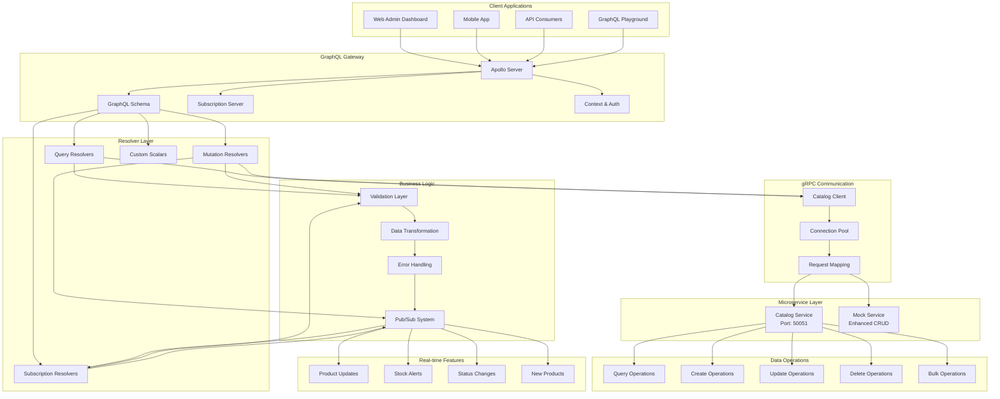
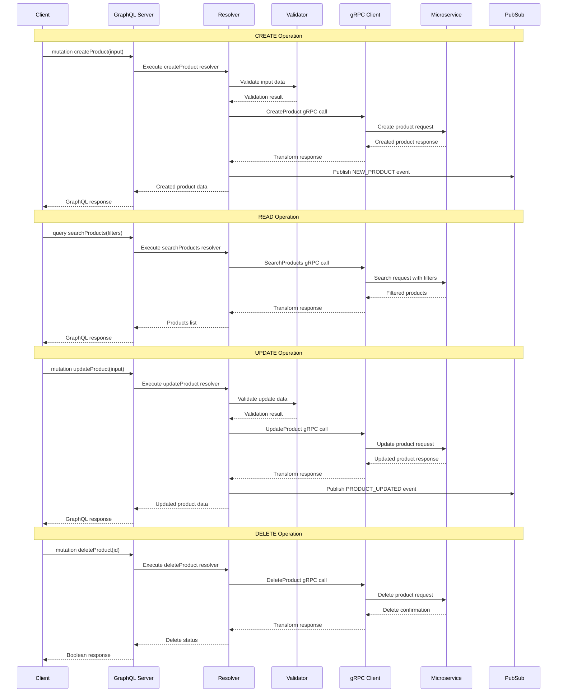

# GraphQL CRUD Operations Architecture

## CRUD Operations Flow

## Key Architecture Components

### GraphQL Layer
- **Apollo Server**: Production-ready GraphQL server with subscriptions
- **Schema Definition**: Comprehensive type system with enhanced CRUD operations
- **Resolver Architecture**: Modular resolvers for different operations
- **Context Management**: Request context with authentication and validation

### Business Logic Layer
- **Input Validation**: Comprehensive validation for all mutations
- **Data Transformation**: gRPC to GraphQL format conversion
- **Error Handling**: Structured error responses with proper error codes
- **Pub/Sub System**: Real-time event publishing for subscriptions

### Communication Layer
- **gRPC Clients**: Type-safe clients with connection pooling
- **Request Mapping**: GraphQL to gRPC parameter transformation
- **Response Handling**: Error handling and data transformation
- **Health Monitoring**: Service availability checking

### CRUD Operations Support

#### Create Operations
- Single product creation with validation
- Bulk product creation with batch processing
- Duplicate product functionality
- Real-time notifications for new products

#### Read Operations
- Single product queries with optional metrics
- Advanced search with filtering and sorting
- Category-based queries with pagination
- Analytics queries (top selling, low stock, recent)

#### Update Operations
- Comprehensive product updates
- Stock level management with operations (ADD/SUBTRACT/SET)
- Status management (activate/deactivate/archive)
- Bulk update operations

#### Delete Operations
- Soft delete (archive) functionality
- Hard delete capability
- Bulk delete operations
- Reason tracking for deletions

### Real-time Features

#### Subscription Types
- **Product Updates**: Real-time product changes
- **Stock Alerts**: Low stock notifications
- **Status Changes**: Product status modifications
- **New Products**: Category-based new product alerts

#### Event System
- Publisher-Subscriber pattern for real-time updates
- Topic-based routing for targeted notifications
- Connection management for WebSocket clients
- Event filtering and transformation

## Performance Optimizations

### Caching Strategy
- Schema-level caching for static data
- Resolver-level caching for expensive operations
- Connection pooling for gRPC clients
- Query result caching with TTL

### Scalability Features
- Horizontal scaling support
- Load balancing for gRPC services
- Connection multiplexing
- Background job processing for bulk operations

### Monitoring & Observability
- Health check endpoints
- Performance metrics collection
- Error tracking and alerting
- Query complexity analysis

This architecture provides a robust, scalable foundation for e-commerce CRUD operations with real-time capabilities and comprehensive data management features.