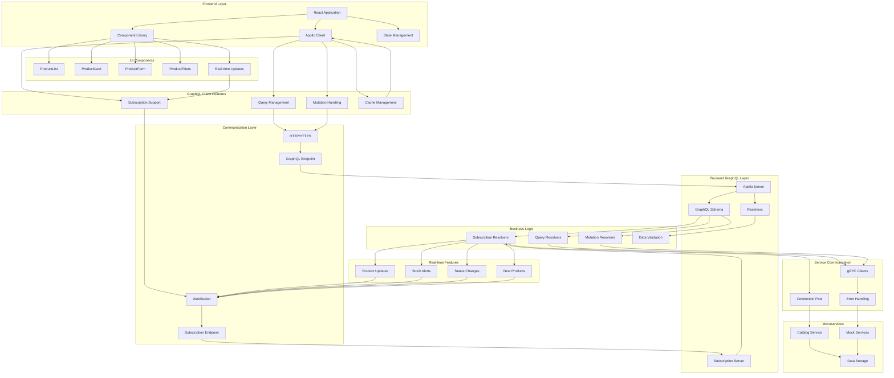
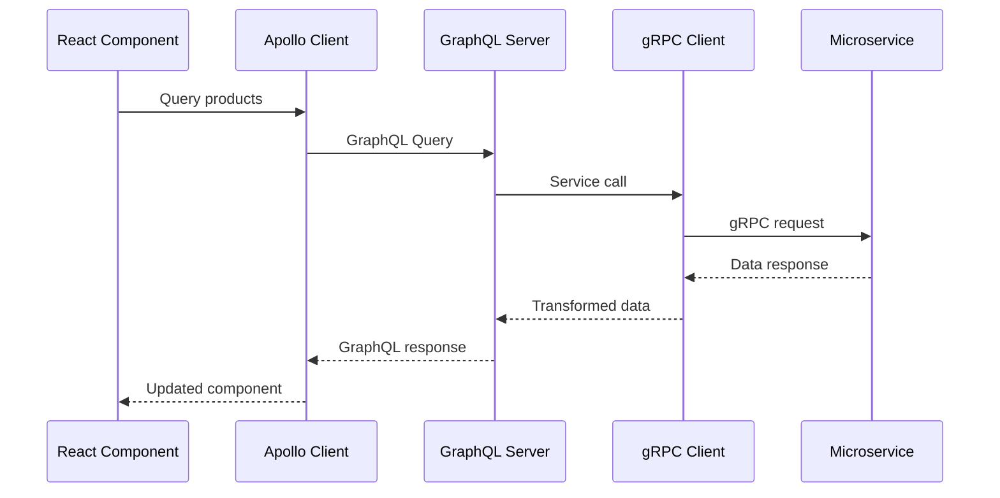
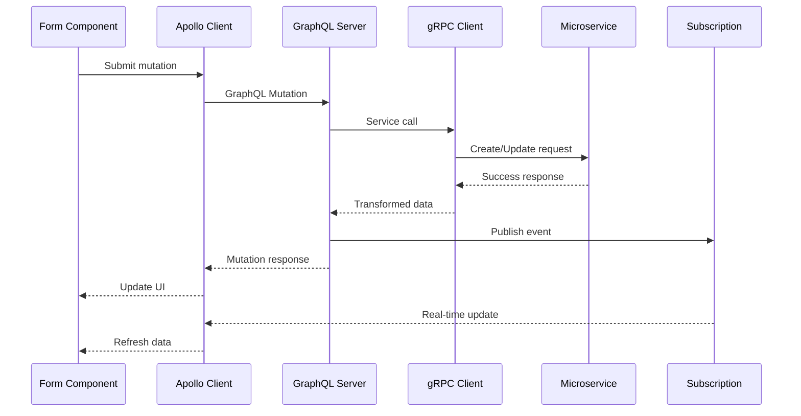
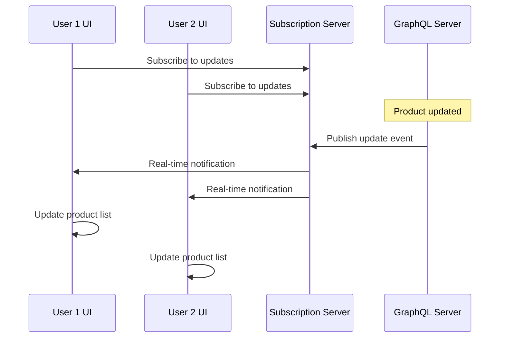

# Full Stack GraphQL E-commerce Architecture

## Architecture Layers

### Frontend Architecture (React + TypeScript)

#### Component Structure
- **App**: Main application wrapper with Apollo Provider
- **ProductList**: Main container component with data fetching
- **ProductCard**: Product display component with actions
- **ProductForm**: Create/edit form with validation
- **ProductFilters**: Advanced filtering and search interface

#### State Management
- **Apollo Client Cache**: Centralized GraphQL state management
- **Local Component State**: Form state and UI interactions
- **Real-time Updates**: Subscription-based live data updates

#### Key Features
- **Type Safety**: Full TypeScript integration
- **Real-time Updates**: WebSocket subscriptions
- **Responsive Design**: Mobile-first Tailwind CSS
- **Form Validation**: React Hook Form integration
- **Notifications**: Toast notifications for user feedback

### Backend Architecture (GraphQL + gRPC)

#### GraphQL Layer
- **Apollo Server**: Production-ready GraphQL server
- **Schema Definition**: Complete type system with documentation
- **Resolver Architecture**: Modular resolvers for different operations
- **Subscription Support**: Real-time WebSocket connections

#### Service Integration
- **gRPC Communication**: Type-safe service-to-service calls
- **Connection Pooling**: Efficient resource management
- **Error Handling**: Comprehensive error management
- **Data Transformation**: gRPC to GraphQL format conversion

## Data Flow Patterns

### Query Flow

### Mutation Flow

### Real-time Updates Flow

## Key Features Implemented

### CRUD Operations
- **Create**: Product creation with validation
- **Read**: Advanced querying with filters and pagination
- **Update**: Comprehensive product updates and stock management
- **Delete**: Soft delete with reason tracking

### Real-time Capabilities
- **Product Updates**: Live updates when products change
- **Stock Alerts**: Notifications for low inventory
- **Status Changes**: Real-time status update notifications
- **New Products**: Alerts for new products in categories

### Advanced UI Features
- **Search & Filter**: Text search with multiple filters
- **Sorting**: Flexible sorting options
- **Pagination**: Efficient data loading
- **Form Validation**: Comprehensive input validation
- **Error Handling**: User-friendly error messages
- **Loading States**: Skeleton loading and spinners

### Performance Optimizations
- **Query Batching**: Efficient data fetching
- **Cache Management**: Smart caching strategies
- **Connection Pooling**: Optimized service communication
- **Lazy Loading**: On-demand component loading
- **Subscription Filtering**: Targeted real-time updates

## Technology Stack

### Frontend
- **React 18**: Modern React with hooks
- **TypeScript**: Full type safety
- **Apollo Client**: GraphQL state management
- **Tailwind CSS**: Utility-first styling
- **React Hook Form**: Form management
- **Heroicons**: SVG icons
- **React Toastify**: Notifications

### Backend
- **Node.js**: JavaScript runtime
- **Apollo Server**: GraphQL server
- **TypeScript**: Type-safe backend
- **gRPC**: Service communication
- **GraphQL Subscriptions**: Real-time updates
- **Express**: HTTP server framework

### Development
- **Vite**: Fast build tool
- **ESLint**: Code linting
- **Prettier**: Code formatting
- **Concurrently**: Parallel script execution

This architecture provides a robust, scalable foundation for modern e-commerce applications with real-time capabilities and excellent developer experience.